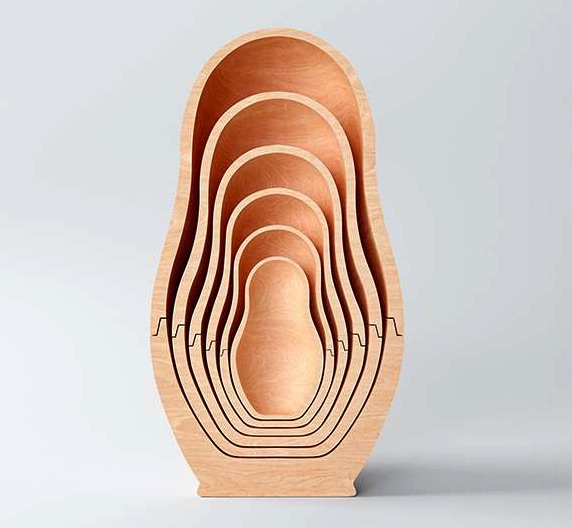

  

## Recursos para el Hackathon de Cuántica (CCCB, 29-30 de Junio)

### Presentaciones
[Presentación general del hackathon](presentaciones/general.pdf)

### Datasets
[Enlaces a los datasets del colisionador de Hadrones del CERN](datasets/cern)

[Enlaces a los datasets de simulaciones del Universo del PIC](datasets/pic)

[Resultados de la encuesta de conocimientos de física cuántica en CCCB](datasets/cccb)

### Código
[Ejemplos para visualizar texturas en WebVR, con AFrame](codigo/texturas)

[Ejemplos para visualizar nubes de puntos en WebVR, con AFrame](codigo/cloudpoint)

[Ejemplos para analizar redes a partir de las simulaciones, con Python](codigo/redes)

### Inspiración

[Visualización 3D de cada uno de los eventos en el experimento LHCb del CERN](http://clangenb.web.cern.ch/clangenb/)
[]

