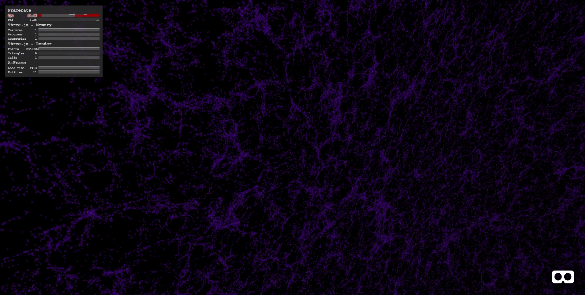

<p align="center">
  
</p>


## Visualizador de nubes de puntos 

Aquí tienes el código para visualizar en 3D un fichero csv entero de galaxias. El PIC nos ha cedido el fichero '5116.csv' justo para esto, es un octante entero (4 millones de galaxias). Verás que en el index.html existe esta línea:

````
       <a-entity galaxy="data: data/5116.csv; radius: 3; opacity: 0.5; sampling_rate: 2" position="0 0.5 0"></a-entity>
````

Lo que hace es llamar al componente 'aframe-galaxy.js', que hemos escrito para el hackathon, con los siguientes parámetros:

- data: Ruta del fichero csv con los datos de las galaxias. En este repositorio no hay ninguno, por temas de licencia, lo puedes coger del del PIC
- radius: El radio de la nube de puntos, en metros
- opacity: La opacidad de los puntos (1-10)
- sampling_rate: (De 1 en adelante) -> Con cuántos puntos nos quedamos del .csv (con 1 nos quedamos con todos, con 2 con la mitad, etc..)
- color_scale: Escala de colores de d3, con la que se pintan los puntos en base a su luminosidad [Aquí tienes las que puedes usar](https://github.com/d3/d3-scale-chromatic) (todas las que empiecen por 'interpolate')
- point_size: El tamaño de los puntos. El valor por defecto es de 0.0025, 2.5 milímetros

Para ver los puntos en un headset, lo mejor de usar un sampling_rate de por lo menos '4'. Por otro lado, como el octante no cubre del todo la bóveda celeste, la función 'make_cloud' de 'aframe-galaxy.js' la puedes llamar varias veces, para replicar los puntos en una latitud y longitud diferente (ojo, porque en este caso habrá que poner el sampling_rate en 25 por lo menos.
