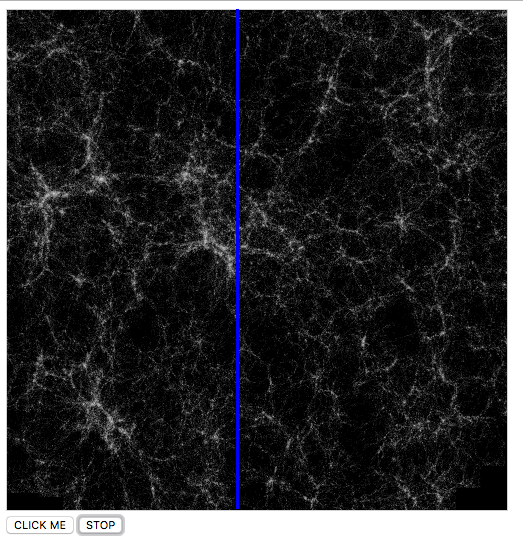

## Sonificando imágenes de simulaciones del Universo

  

Partiendo de la secuencia de imágenes a diferentes redshift, puedes escuchar como 'suenan' con el vengador, abriendo el 'index.html' incluído y su código javascript. Jugando un poco con los parámetros puedes incluir otra escala, otra duración y otros límites.
El programa va recorriendo verticalmente la imagen y mapeando la intensidad de luz de cada pixel de la columna a una escala de notas: los píxeles de arriba se mapean a las notas más bajas y los de abajo a las más altas. Hay umbrales de mínima intensidad para jugar con el silencio.

