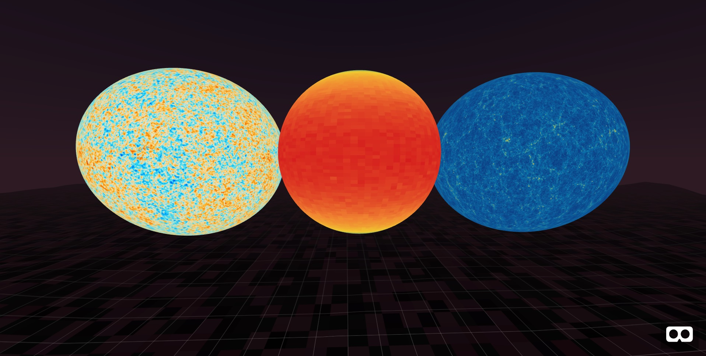
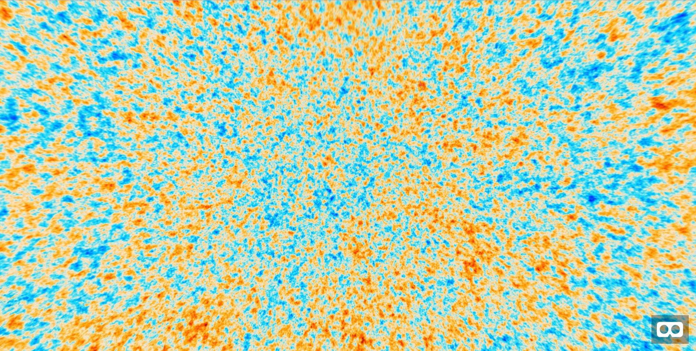
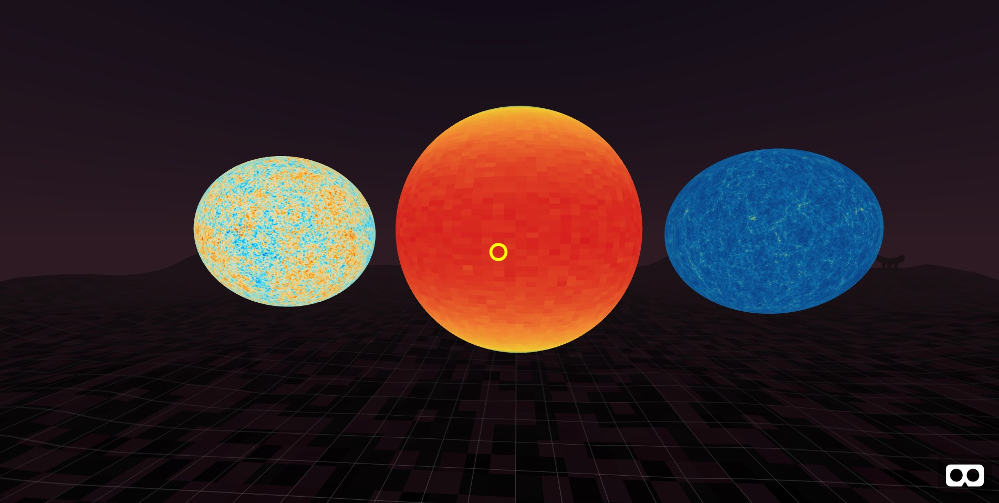

## Jugando con texturas cosmológicas en WebVR

[WebVR](https://en.wikipedia.org/wiki/WebVR) es un API para navegadores que te permite crear contenido de Realidad Virtual y ejecutarlo en el dispositivo que sea compatible (Google Cardboard, HTC Vive, Oculus Rift, Oculus Go, Oculus Quest, etc..) simplemente apuntando a la URL donde aloje tu página en el navegador web del dispositivo.

Para programar en WebVR necesitas usar una librería javascript compatible, la más usada es [AFrame](https://aframe.io/). Los ejemplos están en la página principal y la documentación [aquí](https://aframe.io/docs/0.9.0/introduction/). Con código HTML relativamente sencillo puedes desarrollar experiencias con fotos y vídeos 360, modelos 3D, sonidos 3D, interacción, etc. Para cosas más avanzadas, puedes programar en javascript. La librería se extiende escribiendo componentes.

Con las texturas generadas por el PIC [aquí]() puedes 'envolver' esferas y ver como se verían en la bóveda celeste, tanto desde dentro como desde fuera. 


## Cómo ver texturas desde fuera

<p align="center">
  
</p>

[Aquí](texturas_fuera) tienes un 'index.html' de ejemplo para generar esferas con texturas, y verlas desde las Oculus Go o Quest (este último en 'room-scale', es decir, puedes 'pasearte' por el entorno que hayas creado)

El ejemplo usa el componente ['aframe-environment'](https://github.com/supermedium/aframe-environment-component), que te permite 'vestir' un poco el entorno con cielos, suelos y objetos alrededor de tus modelos.
El resto del código usa la primitiva 'a-sphere', que puedes consultar en la documentación

## Cómo ver texturas desde dentro

<p align="center">
  
</p>

[Aquí](texturas_dentro) tienes un 'index.html' de ejemplo para ver las texturas desde dentro, como si estuvieras suspendido en la bóveda celeste y observando el Universo.

El código es muy parecido, con el único cambio de que hay una sola esfera, de radio 100 metros y en la que la textura 'se pega' a su interior ('side:back')


## Cómo añadir interacción

<p align="center">
  
</p>

[Aquí](interaccion) tienes un 'index.html' igual que el anterior, pero con interaccion añadida. 

Verás que en pantalla sale un cursor amarillo: Esa interacción es para Desktop y desarrollar.

```     <a-camera>
          <a-entity cursor
                    position="0 0 -1"
                    geometry="primitive: ring; radiusInner: 0.02; radiusOuter: 0.03"
                    material="color: yellow; shader: flat">
          </a-entity>
      </a-camera>
```      

Más abajo, en estas líneas se instancian los controladores para Oculus Go o Quest:

```
       <a-entity laser-controls="hand: right"></a-entity>
       <a-entity laser-controls="hand: left"></a-entity>
```

(Recuerda que a la hora de usar el ejemplo en un headset, debes comentar las líneas del cursor, para que no 'se pise' con los controladores)


Por último, se ha escrito un mini-componente para incluir interacción en las 3 esferas. Lo verás al principio en el tag 'SCRIPT' (también lo puedes llevar a un fuente separado de javascript). [Aquí](https://aframe.io/docs/0.9.0/introduction/writing-a-component.html) puedes encontrar más info sobre los componentes de AFrame. En este caso, cuando el cursor o el 'rayo' que sale de los controladores se encuentra con alguna de las esferas, se le modifica el radio. Usando código parecido puedes programar todo tipo de interacciones con la escena y caminar hacia una experiencia más rica.


      
      
        


