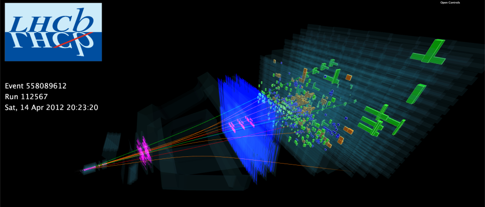

  

## CERN Open Data

* En [https://lavanya.ai/2019/05/31/searching-for-dark-matter/](https://lavanya.ai/2019/05/31/searching-for-dark-matter/) puedes encontrar un post que (después de introducir en profundidad el CERN y sus datos) entra en detalle en dos experimentos: 
    - Detección de partículas mediante técnicas de Machine Learning
    - Detección de materia oscura
* El post anterior va acompañado de un 'kernel' de Kaggle con el código en Python para seguir el experimento: [https://www.kaggle.com/lavanyashukla01/searching-for-dark-matter](https://www.kaggle.com/lavanyashukla01/searching-for-dark-matter)
* En la [web de Open Data del CERN](http://opendata.cern.ch/) puedes encontrar todos los datasets, experimentos y software en abierto del centro
